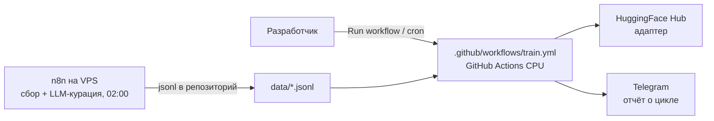
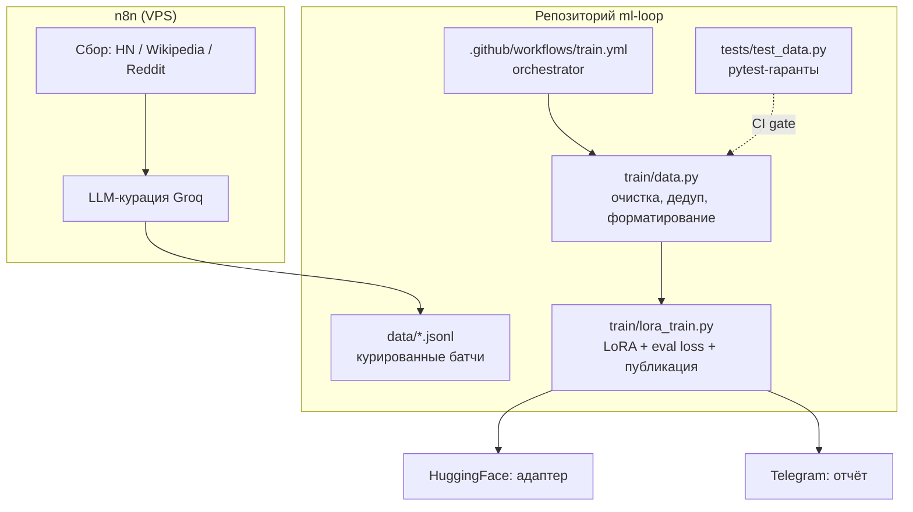

# Architecture — ML-Loop

Документ оформлен по стандарту **arc42** (12 секций), диаграммы — по уровням **C4** в mermaid.

---

## 1. Введение и цели

**ML-Loop** — автономный self-hosted ML-пайплайн: цикл «сбор данных → LLM-курация → LoRA fine-tuning → публикация адаптера» без участия человека.

### Топ-3 цели
1. **Полная автономность**: цикл запускается по расписанию, человек не нужен
2. **Zero-cost**: без GPU-серверов — GitHub Actions (CPU) + free-tier API
3. **Самоулучшение**: модель адаптируется к новым данным, eval loss падает (3.87 → 3.77)

### Стейкхолдеры
| Роль | Интерес |
|------|---------|
| Владелец системы | адаптер свежий, цикл живёт, отчёты в Telegram |
| ML-инженер | eval loss, качество данных, воспроизводимость |
| Читатель репозитория | как устроен loop, что менять под свою задачу |

---

## 2. Ограничения архитектуры

- Без GPU: обучение только на CPU GitHub Actions (7 GB RAM) → модель Qwen2.5-0.5B
- Free-tier: Groq API (курация), HuggingFace (хостинг адаптера)
- Данные и конфиги живут в Git (workflow-as-code), внешней БД нет
- Один разработчик — решения оптимизированы под простоту восстановления

---

## 3. Контекст системы (C4 Level 1: Context)

**Бизнес-контекст:** ML-модели устаревают за недели. Ручное переобучение = GPU + время разработчика. ML-Loop закрывает это бесплатно и без человека.

**Технический контекст:** n8n собирает тексты из трёх источников, Groq (Llama 3.1) отсеивает токсичность/спам/PII, курированные батчи ложатся в `data/*.jsonl`; Actions обучают LoRA-адаптер и публикуют на HF.

---

## 4. Стратегия решений

| Решение | Обоснование | Альтернатива (отклонена) |
|---------|-------------|--------------------------|
| GitHub Actions вместо GPU-сервера | бесплатно, CPU хватает для 0.5B | свой GPU: дорого, простой |
| LoRA вместо full fine-tune | минимальный ранг = быстрое CPU-обучение (~4 мин) | full: не влезет в RAM |
| Groq LLM-куратор вместо человека | $0.59/млн токенов, автоматический отсев | ручная разметка: медленно |
| n8n для сбора | self-hosted, визуальный workflow, cron | скрипт на VPS: меньше наблюдаемости |
| Данные в Git (jsonl) | воспроизводимость, infra-as-code, бэкап бесплатно | БД: лишний компонент |
| Shingle-дедупликация (порог 50%) | защита от переобучения на дублях | без дедупа: деградация качества |

---

## 5. Структура блоков (C4 Level 2: Container, Level 3: Component)

**Таблица-карта файлов:**
| Файл | Роль | Связан с |
|------|------|----------|
| `n8n/ml-loop-collect.json` | workflow сбора + курации (экспортирован в Git) | n8n на VPS |
| `data/*.jsonl` | курированные батчи для обучения | train/data.py |
| `train/data.py` | загрузка, очистка, дедуп, форматирование | train/lora_train.py, tests/ |
| `train/lora_train.py` | LoRA fine-tune, eval loss, публикация на HF | секреты, HF Hub |
| `.github/workflows/train.yml` | запуск цикла по расписанию/вручную | train/* |
| `tests/test_data.py` | pytest-гаранты подготовки данных | pytest.ini |
| `.env.example` | шаблон секретов: GROQ_API_KEY, HF_TOKEN | train/lora_train.py |
| `CHANGELOG.md` / `CONTRIBUTING.md` | история изменений и правила вклада | — |
| `ml-loop.jpg` / `ml-loop2.jpeg` | визуальные схемы для README | README.md |

**Точка входа:** чтение начинай с `.github/workflows/train.yml` — там виден весь цикл целиком.

---

## 6. Runtime-сценарии

**Сценарий 1 — плановый цикл:**
1. n8n по cron (02:00) собирает тексты из HN / Wikipedia / Reddit
2. Groq-куратор отсеивает токсичность, спам, PII → батч коммитится в `data/`
3. Actions (cron понедельника или Run workflow) запускает `train/data.py`
4. Проверки Has Data (count > 0) и Enough Data (≥ 50 примеров)
5. `train/lora_train.py`: LoRA → eval loss → публикация адаптера на HF
6. Отчёт в Telegram: метрики, статус, ссылка на адаптер

**Сценарий 2 — нехватка данных (мягкий скип):**
1. Батч меньше порога 50 примеров
2. Обучение пропускается, workflow завершается успешно
3. Система не падает, цикл живёт до следующего запуска

**Сценарий 3 — отказ источника:**
1. Reddit блокирует IP
2. Fallback: сбор из HN + Wikipedia
3. Цикл продолжается без ручного вмешательства

---

## 7. Деплой и масштабирование

**Текущая инфраструктура:**
- Сбор/курация: n8n self-hosted на VPS
- Обучение: GitHub Actions (ubuntu-latest, CPU)
- Хостинг модели: HuggingFace Hub (free)

**План масштабирования:**
| Рост | Узкое место | Решение |
|------|-------------|---------|
| модель 1.5–3B | 7 GB RAM раннера | свой runner на VPS с RAM 16+ или DGX |
| данные 100к+ строк | размер репозитория | внешнее хранилище (HF datasets) |
| несколько доменов | один адаптер | матрица конфигов «домен → адаптер» |

**Восстановление при падении:** всё stateless и в Git: данные в `data/`, workflow в `.github/`, секреты в GitHub Secrets. Восстановление = повторный Run workflow. n8n-воркфлоу восстанавливается импортом `n8n/ml-loop-collect.json`.

---

## 8. Сквозные концепции

- **Workflow-as-code**: n8n-JSON и Actions-yaml в репозитории — инфраструктура восстанавливается из Git
- **Мягкие скипы**: нехватка данных ≠ авария; цикл переживает пустые запуски
- **Fallback по источникам**: деградация сбора без остановки цикла
- **Секреты вне кода**: только GitHub Secrets / `.env`, никогда в файлах
- **Eval loss как gate**: качество обучения измеряется каждой итерацией

---

## 9. Архитектурные решения (ADR-lite)

**ADR-1: LoRA r=8 / alpha=16.** Минимальный ранг = быстрое CPU-обучение при сохранении качества. Альтернатива (r=16+) отклонена: дольше, выигрыш маргинальный.

**ADR-2: Groq Llama 3.1 как куратор.** $0.59/млн токенов против $15 у Claude (25x дешевле), качество отсева сопоставимо.

**ADR-3: данные в Git, не в БД.** Батчи маленькие (jsonl по 0.5–13 КБ), Git даёт версионность и бэкап бесплатно. Последствия: при росте объёма — миграция на HF datasets (зафиксировано в секции 7).

**ADR-4: shingle-дедуп с порогом 50%.** Баланс: жёстче — теряем данные, мягче — риск переобучения на дублях.

---

## 10. Требования к качеству

| Требование | Сценарий | Целевая метрика |
|------------|----------|-----------------|
| Длительность цикла | полный прогон | < 10 минут (факт ~4 мин) |
| Качество | каждая итерация | eval loss не растёт (3.87 → 3.77) |
| Отказоустойчивость | источник упал | fallback HN+Wiki, цикл жив |
| Стоимость | месяц работы | $0 (free-tier) |
| Воспроизводимость | повторный Run | тот же результат на тех же данных |

---

## 11. Риски и технический долг

**Риски:**
- Reddit блокирует IP → митигация: fallback (сценарий 3)
- Урежут free-tier Groq/HF → митигация: fallback-список провайдеров курации
- 0.5B модель мала для сложных доменов → митигация: путь на больший раннер (секция 7)

**Техдолг (осознанный):**
- Нет тестов на `train/lora_train.py` (нужен mock HF) — план: добавить
- Нет алерта на рост eval loss (дрейф) — план: Telegram-алерт при деградации
- Дубли батчей в `data/` (одинаковые sha) — косметика, план: чистка

---

## 12. Глоссарий

| Термин | Значение |
|--------|----------|
| LoRA | Low-Rank Adaptation: дообучение малой надстройкой весов |
| Адаптер | публикуемая надстройка к базовой модели |
| Eval loss | метрика качества обучения (ниже = лучше) |
| Shingle-дедуп | удаление похожих текстов по n-граммам |
| LLM-куратор | модель, отбирающая качественные тексты |
| Workflow-as-code | инфраструктура хранится в Git как код |

---

## Как менять этот проект

| Хочу… | Куда идти |
|-------|-----------|
| добавить источник данных | `n8n/ml-loop-collect.json` |
| поменять модель/ранги | `train/lora_train.py` |
| поменять пороги (дедуп, min examples) | `train/data.py` |
| поменять расписание | `.github/workflows/train.yml` |
| добавить домен обучения | новый батч в `data/` + конфиг |

После правки: `git add . && git commit && git push` — следующий плановый цикл подхватит изменения сам.