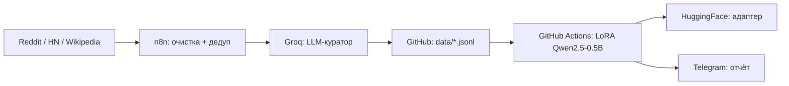

# ML-Loop — self-hosted ML pipeline

Автоматический цикл: сбор данных → очистка → LoRA fine-tuning → публикация адаптера.

## Архитектура

## Решения (почему так)

- Groq вместо Claude: $0.59 vs $15 за млн токенов (25x дешевле), качество сопоставимо
- GitHub Actions вместо своего GPU: бесплатно, 7GB RAM CPU достаточно для 0.5B
- LoRA r=8/alpha=16: минимальный ранг = быстрое обучение на CPU
- Self-hosted: никаких облачных зависимостей
- Секреты в GitHub Secrets, никогда в коде

## Запуск

1. Данные собирает n8n workflow (ежедневно 02:00)
2. Обучение: Actions → ml-loop-train → Run workflow (или cron по понедельникам)