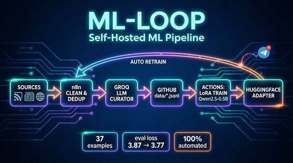

# ML-Loop — self-hosted ML pipeline

  

---

## Презентация

---

## Как выглядит backend

Автоматический цикл: сбор данных → очистка → LoRA fine-tuning → публикация адаптера.

---

## Что с этим можно построить

- **Автономное дообучение модели на своих данных** — цикл сам собирает, отбирает и обучает без человека
- **LLM-курация контента** — фильтрация токсичности, спама и PII перед публикацией
- **Zero-cost ML-пайплайн** — обучение на GitHub Actions CPU без GPU-серверов
- **Шаблон production ML-цикла** — workflow-as-code, retries, пороги данных, алерты

---

## Архитектура

## 📚 **Полная архитектурная документация** (arc42 + C4): [ARCHITECTURE.md](ARCHITECTURE.md)

---

## Решения

- Groq вместо Claude: $0.59 vs $15 за млн токенов (25x дешевле), качество сопоставимо
- GitHub Actions вместо своего GPU: бесплатно, 7GB RAM CPU достаточно для 0.5B
- LoRA r=8/alpha=16: минимальный ранг = быстрое обучение на CPU
- Self-hosted: никаких облачных зависимостей
- Секреты в GitHub Secrets, никогда в коде

---

## Запуск

1. Данные собирает n8n workflow (ежедневно 02:00)
2. Обучение: Actions → ml-loop-train → Run workflow (или cron по понедельникам)
3. n8n workflow сбора данных: `n8n/ml-loop-collect.json` (при импорте подключите свои credentials)

---

## Лицензия
MIT

---

## Автор: **Сергей Исаков** 

## Стек: **Python, Streamlit, pandas, Plotly Связанные проекты: https://github.com/SergIS777/voicebot-analytics · https://github.com/SergIS777/voicebot · https://github.com/SergIS777/multi-agent-rag**

---
